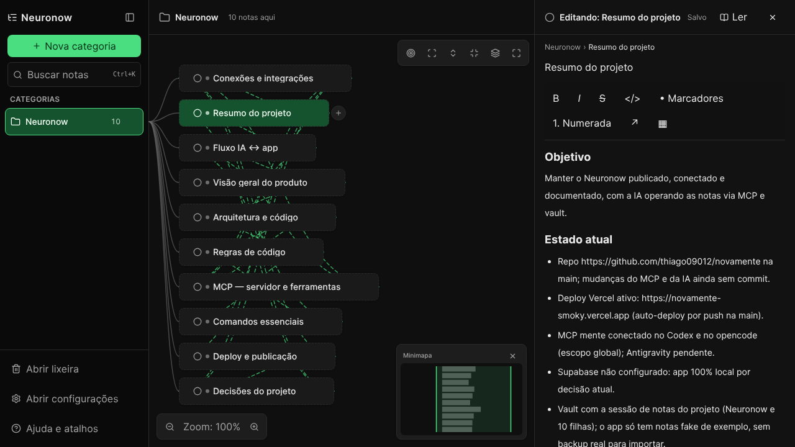
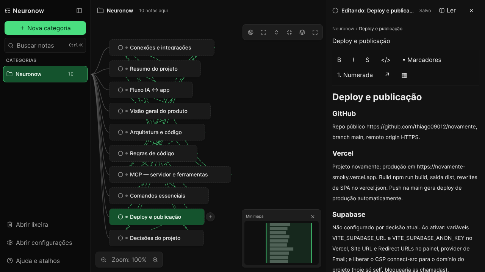

# Neuronow

[](https://github.com/thiago09012/novamente/actions/workflows/ci.yml)
[](LICENSE)
[](https://novamente-smoky.vercel.app)

_Versão em português: [README.pt-BR.md](README.pt-BR.md) · [Live demo](https://novamente-smoky.vercel.app)_

**Local-first project notes, ready to work with AI.** Neuronow organizes notes
in a navigable tree (categories → notes → subnotes) with a rich editor,
`[[wikilinks]]`, instant search and a visual canvas. It runs in the browser
with no account or connection; an optional Supabase account keeps private
copies.

- **Local-first**: data lives in your browser's IndexedDB (or memory, if
  storage fails). Optionally sign in with Supabase and push/pull a private copy
  from Settings.
- **UI in Brazilian Portuguese (pt-BR)**, dark theme by default.
- **Built for humans and AIs**: export a project's context, search connected
  notes and review AI-suggested changes — or give an agent direct access
  through the bundled **MCP server** (see [Neuronow for AIs](#neuronow-for-ais)).




## Features

- **Notes tree**: sidebar categories with descendant counts, icons, colors and
  inline rename; drag-and-drop to reorganize.
- **Category canvas**: tree layout (d3-hierarchy) with pan/zoom, minimap, box
  and multi selection, branch focus, wikilink edges and per-node context menu
  (duplicate, trash, …).
- **Rich editor (TipTap)**: bold/lists/tables/task lists, `/` commands,
  `[[` wikilinks with suggestion popup, backlinks, editable tags, subnotes,
  note icon and color, debounced autosave.
- **Search** (`Ctrl/Cmd+K`): accent-insensitive with fuzzy matching and
  title/tag boosting; `>` command mode for quick actions.
- **Structural undo/redo** (200-step limit) with grouped batch mutations.
- **Trash** with 30-day retention, restore and permanent delete.
- **AI context**: export the active category and its child notes as Markdown
  with IDs, paths, tags and links, without touching the local database.
- **Backup**: export/import **JSON** (full-fidelity), **Markdown** and **OPML**,
  with validation and confirmation before replacing data.
- **Resilience**: automatic memory fallback when the browser quota explodes,
  cross-tab sync (BroadcastChannel), automatic graph repair (orphans/cycles)
  on boot.
- **Optional publishing**: Vercel for the static UI and Supabase Auth +
  Postgres RLS for manual per-account copies. See the
  [publishing guide](docs/DEPLOYMENT.md).
- **Settings**: theme (dark/light/system), density, UI scale, reduced motion,
  wikilink edges.

## Quickstart

Requirements: **Node.js 20+**.

```bash
npm install --legacy-peer-deps   # first time only
npm run dev                      # http://localhost:5173
```

## Commands

| Command                 | What it does                                                 |
| ----------------------- | ------------------------------------------------------------ |
| `npm run dev`           | Dev server (Vite, port 5173)                                 |
| `npm run build`         | Contrast test + typecheck + production build into `dist/`    |
| `npm run preview`       | Serve `dist/` (port 4173 in e2e)                             |
| `npm run test`          | Unit tests (Vitest, co-located in `src/**/*.test.ts`)        |
| `npm run test:watch`    | Tests in watch mode                                          |
| `npm run test:contrast` | WCAG AA contrast only (`src/styles`) — runs before the build |
| `npm run test:coverage` | Coverage (80% thresholds on `domain/` and `db/`)             |
| `npm run typecheck`     | `tsc -b` (strict)                                            |
| `npm run lint`          | ESLint (type-checked)                                        |
| `npm run format`        | Prettier across the repo                                     |
| `npm run e2e`           | Playwright tests (`e2e/`, Chromium)                          |
| `npm run perf:stress`   | Stress e2e (5,000 notes, build + preview)                    |
| `npm run seed:stress`   | Generate an N-note seed JSON (never touches the database)    |
| `npm run neuronow`      | AI context and vault CLI (`npm run neuronow -- help`)        |
| `npm run mente`         | Compatibility alias for the old CLI name                     |
| `npm run mcp`           | Local MCP stdio server                                       |
| `npm run mente:connect` | Interactive MCP client setup wizard                          |

## Neuronow for AIs

Neuronow exposes a **Markdown vault**: a backup becomes a folder of `.md`
files any AI can read and edit with any tooling (coding agents, editors,
scripts). Changes return to the app through **smart merge**.

### Recommended Obsidian flow

1. In Settings → Data, connect a dedicated folder inside your Obsidian vault
   and sync at the start of the session.
2. Edit that folder's `.md` files with Obsidian or with an AI. Notes use
   frontmatter with stable IDs and `[[wikilinks]]`. After syncing, edits made
   in the app are written to the Markdown files first.
3. After the AI edits the files, sync again in the app. It imports the
   changes, writes the consolidated version and creates `.mente/review.md`;
   divergent versions are preserved under `.mente/conflicts/`.
4. Keep a child note `Resumo do projeto` with goal, state, decisions, pending
   items, risks and next step.

### MCP server (direct agent access)

`scripts/mcp-server.ts` speaks MCP over stdio with 8 tools (`mente_tree`,
`mente_search`, `mente_read`, `mente_create`, `mente_move`, `mente_tag`,
`mente_prepare`, `mente_package`) operating on the vault folder. Register it
in any MCP client:

```bash
npm run mente:connect -- --ide cursor --scope global --dry-run  # preview first
```

Supported clients: Antigravity, Cursor, VS Code, Claude Desktop, Windsurf,
opencode, plus a ready command for Claude Code. The server re-reads files on
every call and never touches the browser's IndexedDB — export/import in the
app remains the round-trip. Full agent handoff:
[`docs/AI_PLAYBOOK.md`](docs/AI_PLAYBOOK.md).

### Alternative CLI flow (backup JSON)

```bash
# 1) In the app: Settings → Data → export the JSON backup

# 2) Prepare only the project the AI will work on
npm run neuronow -- ai:prepare --input backup.json --out ./neuronow-vault --root "Project X"

# 3) Search facts with an approximate token budget
npm run neuronow -- ai:context "deadlines and next steps" --vault ./neuronow-vault --budget 1800

# 4) The AI can read/edit .md directly or use the vault commands
npm run neuronow -- tree --vault ./neuronow-vault
npm run neuronow -- read --path path/note.md --vault ./neuronow-vault
npm run neuronow -- create --parent "Project X" --title "New note" \
                   --tags ai,review --body "content" --vault ./neuronow-vault

# 5) Export an updated backup and package with scope review
npm run neuronow -- ai:package --vault ./neuronow-vault --base current-backup.json \
                   --root "Project X" --out neuronow-merged.json

# 6) Review .mente/review.md and import the JSON in the app
```

The app also offers **Export active project context for AI** in Settings →
Data. It includes only the active category and descendants, with IDs and
paths so the AI can cite sources.

The scoped vault includes `.mente/AGENTES.md`, `.mente/manifest.json` and a
`.mente/base.json` holding only the selected project. When packaging, pass a
fresh full backup in `--base`; the CLI preserves the remaining notes and
rejects out-of-scope changes. The report lands in `.mente/review.md`.
`mente-vault/` and `neuronow-vault/` are git-ignored so personal notes are
never published.

IndexedDB stays the local cache used by the UI; after syncing, app writes go
to the Markdown files first. Sync after external AI/Obsidian edits and at the
start of each session. The browser may ask for folder permission again.
Deleting a `.md` file never deletes a note; deletions happen in the app to
avoid accidental data loss.

**Per-session project memory:** keep a child note called `Resumo do projeto`
inside the category. Write goal, current state, decisions, pending items,
risks and next step in it. `ai:context` includes that note first and trims
the remaining excerpts to fit the approximate `--budget` (character estimate,
not an exact tokenizer). Without a summary, the category note anchors the
context. On multi-project backups, pass `--root` to avoid searching the
wrong project.

### Merge rules

- **Never deletes**: live notes missing from the folder survive the result
  (deleting a file does **not** delete the note — deletion happens in the
  app).
- **Per-note LWW**: on conflict, the higher (or equal) `updatedAt` wins.
  Re-export the vault before editing so your edit wins.
- **`.mente/base.json` inheritance**: if frontmatter is rewritten minimally
  (only `id`), missing fields (`tags`, `icon`, `color`, `orderKey`, dates)
  are inherited from the snapshot used to prepare the vault. In `ai:package`,
  `--base` may point at the latest full backup to detect conflicts.
- **Automatic repair**: orphans, cycles and invalid content are normalized on
  import; the app also repairs on boot.
- **Full-fidelity format** stays **JSON** (`mente-backup` v1); the Markdown
  vault is the editing layer. Markdown conversion does not represent every
  rich-editor feature; keep the original backup.

### Note frontmatter

```markdown
---
id: 01J8ZK9...
parentId: 01J8ZK3... # null = category (root note)
orderKey: a2 # position among siblings (fractional indexing)
title: My note
tags: [project, ai]
icon: circle
color: null
createdAt: 1791312000000
updatedAt: 1791312000000
---

Free-form Markdown body. Wikilink: [[Exact title]]. Task: - [ ] todo.
```

Hierarchy: folders mirror `parentId`; notes with children become
`folder/_index.md`. The true parent is the frontmatter `parentId`; the folder
path only applies when `parentId` is absent.

### CLI reference

```bash
npm run neuronow -- help
```

Commands: `ai:prepare`, `ai:context`, `ai:package`, `vault:export`,
`vault:import`, `search`, `read`, `tree`, `create`, `move`, `tag`,
`manifest`, `help`. Implementation: `scripts/mente.ts` (only `src/domain/`),
codec in `src/domain/markdown.ts`, vault graph in `src/domain/vault.ts`, MCP
server in `scripts/mcp-server.ts`.

## Architecture

```
UI (React)  →  stores (Zustand)  →  repositories  →  Dexie/IndexedDB
                                                     or in-memory backend
Pure rules: src/domain/ (no React, no Dexie) — tree, order, links,
            backup, markdown codec, vault, repair
```

- **Layers**: pure `domain/` · `db/` (Dexie, migrations, seed, sync) ·
  `features/` (sidebar, canvas, editor, search, trash, settings, help,
  pickers) · `store/` (Zustand) · `app/` (bootstrap and layout) ·
  `components/ui/` (primitives) · `i18n/` (pt-BR) · `styles/` (theme tokens).
- **`mente` database** (Dexie): `notes`, `links`, `settings`, `views`, `meta`.
  ULID ids, fractional-indexing order (`orderKey`), trash with
  `deletedAt`/`deletedRootId`.
- **Cross-tab sync**: BroadcastChannel `mente-database-sync-v1`.
- **JSON backup** (`mente-backup` v1): `parseBackup` validates format,
  schemas, references and cycles before any write; import is one atomic
  transaction (clear + bulkPut + repair) followed by a page reload.

More: [`docs/ARCHITECTURE.md`](docs/ARCHITECTURE.md).

## Project structure

```
src/
  app/           bootstrap, AppShell, runtime (Dexie ↔ memory)
  components/ui/ primitives (Button, Dialog, Menu, Toast, Icon, ...)
  db/            Dexie, migrations, seed, backup, sync, repair, repositories
  domain/        pure rules (tree, order, links, backup, markdown, vault, ...)
  features/      sidebar, canvas, editor, search, trash, settings, help, pickers
  i18n/          pt-BR (typed t())
  mcp/           MCP client definitions for the setup wizard
  store/         Zustand (notes, settings, view, ui)
  styles/        theme tokens + global (Tailwind v4) + contrast test
  tests/         test setup and factories
e2e/             13 Playwright specs (backup, tree, search, sync, axe, ...)
scripts/         mente.ts (CLI), mcp-server.ts (MCP), mente-connect.ts (setup), seed-stress.ts
docs/            ARCHITECTURE, SHORTCUTS, HANDOFF, PLAN, DECISIONS, AI_PLAYBOOK
```

## Tests

- **Unit** (Vitest + Testing Library): co-located in `src/`,
  `fake-indexeddb` for the `db/` layer. Today: **205 tests in 25 files**.
- **Contrast** (77 WCAG AA assertions): runs as `prebuild` — the build fails
  if the theme regresses.
- **E2e** (Playwright, Chromium, pt-BR): 13 specs covering tree CRUD, search,
  backup (JSON/MD/OPML), trash, cross-tab sync, shortcuts, drag, multi-select,
  memory fallback and accessibility (axe).
- **Coverage**: 80% thresholds on `src/domain/**` and `src/db/**`.

## Main shortcuts

`Ctrl/Cmd+K` search · `Ctrl/Cmd+N` new note · `Ctrl/Cmd+Shift+N` new category ·
`Ctrl/Cmd+B` sidebar · `Ctrl/Cmd+\` editor · `Ctrl/Cmd+/` help ·
`Ctrl/Cmd+Z` / `Shift+Z` undo/redo · `F2` rename · `Delete` trash.

Full table: [`docs/SHORTCUTS.md`](docs/SHORTCUTS.md).

## Documentation

| File                                               | Contents                               |
| -------------------------------------------------- | -------------------------------------- |
| [`docs/ARCHITECTURE.md`](docs/ARCHITECTURE.md)     | Architecture and data model            |
| [`docs/AI_PLAYBOOK.md`](docs/AI_PLAYBOOK.md)       | Detailed handoff for agents and MCP    |
| [`docs/SHORTCUTS.md`](docs/SHORTCUTS.md)           | Every keyboard shortcut                |
| [`docs/HANDOFF.md`](docs/HANDOFF.md)               | Technical handoff (env, conventions)   |
| [`docs/PLAN.md`](docs/PLAN.md)                     | Phase plan and status                  |
| [`docs/DECISIONS.md`](docs/DECISIONS.md)           | Technical decision log                 |
| [`prompt-mestre-mente.md`](prompt-mestre-mente.md) | Original product specification (pt-BR) |
| [`AGENTS.md`](AGENTS.md)                           | Operator guide for AIs                 |

## Status

Phases 1–5 done; **Phase 6** (backup and resilience) 🟡 — features ready,
missing formal quota/sync unit tests and a wider axe audit; **Phase 7** ⏳ —
mobile, PWA/offline, onboarding and mobile list. Details in
[`docs/PLAN.md`](docs/PLAN.md).

## Contributing

Contributions are welcome! Please read
[`.github/CONTRIBUTING.md`](.github/CONTRIBUTING.md), the
[Code of Conduct](.github/CODE_OF_CONDUCT.md) and open an issue before large
changes. Good first issues carry the
[`good first issue`](https://github.com/thiago09012/novamente/labels/good%20first%20issue)
label.

## License

[MIT](LICENSE) © 2026 Thiago (thiago09012).
